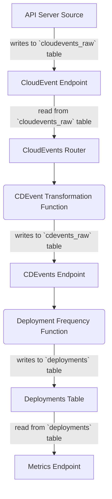

# Métricas de DORA + CloudEvents & CDEvents para Kubernetes

---
_🌍 Disponible en_: [English](README.md) | [中文 (Chinese)](README-zh.md) | [日本語 (Japanese)](README-ja.md) | [Spanish](README-es.md)

> **Nota:** Presentado por la fantástica comunidad
> de [ 🌟 contribuidores](https://github.com/salaboy/platforms-on-k8s/graphs/contributors) cloud-native!

---

Este tutorial instala un conjunto de componentes que consumen [CloudEvents](https://cloudevents.io) desde múltiples orígenes y permite observar las métricas de DORA, usando una arquitectura nativa de Kubernetes (sin dependencias externas).

Esta demostración se centra en observar los distintos orígenes de eventos, para luego mapear estos resultados a eventos relevantes para nuestras prácticas de entrega de software, que pueden ser agregados para calcular las métricas de DORA.

El flujo de transformación de eventos va así:
- La entrada son [CloudEvents](https://cloudevents.io) provenientes de orígenes distintos.
- Estos CloudEvents se pueden mapear y transformar en [CDEvents](https://cdevents.dev) para procesarlos adicionalmente.
- Se pueden definir Funciones de agregación para calcular las métricas de DORA (u otras).
- Las métricas pueden ser expuestas para consumo (en este ejemplo, via REST endpoints).

## Instalación

Utilizaremos un clúster de Kubernetes con Knative Serving para ejecutar nuestras funciones de transformación. Puedes seguir las instrucciones del [Capítulo 8 para crear un clúster con Knative Serving instalado](../../chapter-8/README-es.md#creando-un-kubernetes-con-knative-serving).

Luego instalaremos Knative Eventing, que es opcional, porque utilizaremos Knative Eventing para instalar la API de Event Source de Kubernetes, que toma eventos internos de Kubernetes y los transforma en CloudEvents.

1. Instala [Knative Eventing](https://knative.dev/docs/install/yaml-install/eventing/install-eventing-with-yaml/)
```shell
kubectl apply -f https://github.com/knative/eventing/releases/download/knative-v1.11.0/eventing-crds.yaml
kubectl apply -f https://github.com/knative/eventing/releases/download/knative-v1.11.0/eventing-core.yaml
```

1. Crea tu namespace `dora-cloudevents`: 
```shell
kubectl create ns dora-cloudevents
```

1. Instala PostgreSQL y crea las tablas:
```shell
kubectl apply -f resources/dora-sql-init.yaml
helm install postgresql oci://registry-1.docker.io/bitnamicharts/postgresql --version 12.5.7 --namespace dora-cloudevents --set "image.debug=true" --set "primary.initdb.user=postgres" --set "primary.initdb.password=postgres" --set "primary.initdb.scriptsConfigMap=dora-init-sql" --set "global.postgresql.auth.postgresPassword=postgres" --set "primary.persistence.size=1Gi"
```

1. Instala Sockeye, un monitor sencillo de CloudEvents, requiere instalar Knative Serving: 

```shell
kubectl apply -f https://github.com/n3wscott/sockeye/releases/download/v0.7.0/release.yaml
```

1. Instala [Kubernetes API Server CloudEvent Event Source](https://knative.dev/docs/eventing/sources/apiserversource/getting-started/#create-an-apiserversource-object): 
```shell
kubectl apply -f api-serversource-deployments.yaml
```


## Componentes

Esta demostración despliega los siguientes componentes para transformar CloudEvents en CdEvents y luego agregar los datos disponibles.

- **Endpoint de CloudEvents**: el endpoint para enviar todos los CloudEvents; estos CloudEvents se almacenarán en la base de datos en la tabla `cloudevents-raw`. 

- **Enrutador CloudEvents**: enrutador, con una tabla de enrutamiento, que redirige los eventos para transformarlos en `CDEvents`. Este mecanismo permite que el mismo tipo de evento se transforme en múltiples `CDEvents`, si es necesario. Este componente lee de la tabla `cloudevents-raw`y procesa los eventos. Este componente es lanzado por medio de un periodo de tiempo fijo configurable.

- **Transformador de CDEvents**: estas funciones reciben eventos del `Enrutador de CloudEvents` y transforma los CloudEvents en CDEvents. el resultado se envía al `Endpoint de CDEvents`.

- **Endpoint de CDEvents**: endpoint para enviar `CDEvents`, estos CloudEvents se almacenarán en la base de datos SQL en la tabla `cdevents-raw`, porque no necesitan ninguna transformación. Este endpoint valida que el CloudEvent recibido sean un CD CloudEvent. 

- **Funciones de Métricas**: estas funciones están a cargo de calcular diferentes métricas y guardarlas en tablas especiales, probablemente una por tabla. Para calcular dichas métricas, estas funciones leen de `cdevents-raw`. Un ejemplo de cómo calcular la **frecuencia de despliegue** se explica abajo.

- **Endpoint de Métricas**: endpoint que te permite consultar métricas por nombre y agregar algunos filtros. Este componente es opcional, porque puedes construir un dashboard desde las tablas de las métricas sin usar estos endpoints.


## Desplegando Componentes y generando datos

Primero despliega los componentes y funciones de transformación ejecutando:

```shell
kubectl apply -f resources/components.yaml
```

Abre Sockeye para monitorizar CloudEvents al abrir tu navegador en [http://sockeye.default.127.0.0.1.sslip.io/](http://sockeye.default.127.0.0.1.sslip.io/).

Luego, crea un nuevo despliegue en el namespace `default` para probar que tu configuración funciona.


```shell
kubectl apply -f test/example-deployment.yaml
```

En este punto deberías ver cientos de eventos en Sockeye:


Si las funciones de frecuencia de despliegue (transformación y cálculo) están instaladas, deberías poder consultar el endpoint de frecuencia de despliegue y ver la métrica.
Ten en cuenta que esto puede tomar un par de minutos, porque se utilizan Cron Jobs para agregar los datos periódicamente:

```shell
curl http://dora-frequency-endpoint.dora-cloudevents.127.0.0.1.sslip.io/deploy-frequency/day | jq
```
Y observa algo como esto,
dependiendo de cuáles despliegues has creado (he creado dos despliegues: `nginx-deployment` and `nginx-deployment-3`): 

```shell
[
  {
    "DeployName": "nginx-deployment",
    "Deployments": 1,
    "Time": "2023-08-05T00:00:00Z"
  },
  {
    "DeployName": "nginx-deployment-3",
    "Deployments": 1,
    "Time": "2023-08-05T00:00:00Z"
  }
]

```

Intenta modificar los despliegues o crear nuevos, los componentes están configurados para monitorizar todos los despliegues en el namespace `default`.

Observa que todos los componentes fueron instalados en el namespace `dora-cloudevents`.
Puedes revisar los pods y la url para los servicios de Knative ejecutando los siguientes comandos:
 
Revisa la url para los servicios Knative en el namespace `dora-cloudevents`:
```shell
kubectl get ksvc -n dora-cloudevents
```

Revisa cuáles pods se están ejecutando,
esto lo encuentro interesante porque usando Knative Serving, todas las funciones de transformación que no se están usando no necesitan estar en ejecución todo el tiempo: 

```shell
kubectl get pods -n dora-cloudevents
```

Finalmente, puedes revisar las ejecuciones CronJob que agrega datos ejecutando:

```shell
kubectl get cronjobs -n dora-cloudevents
```

## Desarrollo 

Despliega los componentes `dora-cloudevents` usando `ko`para desarrollar:

```shell
ko apply -f config/
```

# Métricas

De [https://github.com/GoogleCloudPlatform/fourkeys/blob/main/METRICS.md](https://github.com/GoogleCloudPlatform/fourkeys/blob/main/METRICS.md)

## Frecuencia de Despliegue 


Miramos nuestros recursos nuevos o actualizados. Esto se hace usando el `APIServerSource` que configuramos anteriormente.

 
El flujo debería ser


Calcular cubos: diariamente, semanalmente, mensualmente, anualmente.

Esto cuenta el número de despliegues por día:

```sql
SELECT
distinct deploy_name AS NAME,
DATE_TRUNC('day', time_created) AS day,
COUNT(distinct deploy_id) AS deployments
FROM
deployments
GROUP BY deploy_name, day;
```


## TODOs y Extensiones

- Añadir mecanismos de eventos procesados para las tablas `cloudevents_raw` y `cdevents_raw`. Esto debería evitar que el `Enroutador de CloudEvents` y las  `funciones de cálculo de Métricas` recalculen los eventos ya procesados. Esto se puede lograr añadiendo una tabla que almacene el último evento procesado y asegurándose que el `Enroutador de CloudEvents` y las  `funciones de cálculo de Métricas` coinciden con las nuevas tablas.
- añadir consultas para calcular cubos para la Frecuencia de Despliegue: semanalmente, mensualmente, anualmente a `deployment-frequency-endpoint.go`. Revisa el artículo del blog para calcular la frecuencia y no el volúmen: https://codefresh.io/learn/software-deployment/dora-metrics-4-key-metrics-for-improving-devops-performance/
- Crea un chart de Helm para componentes genéricos (Endpoint de CloudEvents, Endpoint de CDEvents, Enrutador de CloudEvents)
- Automatiza la creación de tablas para el chart de Helm para PostgreSQL (https://stackoverflow.com/questions/66333474/postgresql-helm-chart-with-initdbscripts)
- Crear funciones para **Plazo de ejecución de cambios**

## Otras fuentes y Extensiones

- [Instala Tekton](https://github.com/cdfoundation/sig-events/tree/main/poc/tekton)
  - Dashboard de Tekton: `k port-forward svc/tekton-dashboard 9097:9097 -n tekton-pipelines`
  - Controlador de Cloud Events: `kubectl apply -f https://storage.cloud.google.com/tekton-releases-nightly/cloudevents/latest/release.yaml`
  - ConfigMap: `config-defaults` para <SINK URL>
- https://github.com/GoogleCloudPlatform/fourkeys
- https://cloud.google.com/blog/products/devops-sre/using-the-four-keys-to-measure-your-devops-performance
- Eventos de Entrega Continua, también conocido como [CDEvents](https://cdevents.dev)
- CloudEvents [CEs](https://cloudevents.io/)  
- Fuente en GitHub: https://github.com/knative/docs/tree/main/code-samples/eventing/github-source
